# Bug Reports

> **Instructions**: Create 1 bug entry for each TC that has a **Fail** result.
> See [examples/sample-bug-report.md](../examples/sample-bug-report.md) for a good bug report example.

| Information | |
| --- | --- |
| **Team** | stqa_group_15 |
| **Report Date** | 06/06/2026 |

---

## Test Environment

- **Browser**: Chrome (version unspecified)
- **OS**: Linux
- **Interface Language**: Vietnamese

---

## BUG-01: BOOK003 displays "Borrowing" instead of "Borrowed" in the book list

| Attribute | Details |
| --- | --- |
| **Bug ID** | BUG-01 |
| **Related TC** | TC-07 |
| **Related REQ** | REQ-02 |
| **Severity** | Low |
| **Date Found** | 27/05/2026 |
| **Status** | Open |

**Preconditions:**
Successfully logged in, data is at seed state.

**Steps to Reproduce:**
1. Log in with member account `binh.pham@email.com`.
2. Navigate to the "Books" (Sách) tab.
3. Observe the list and the status of BOOK003.

**Expected Result:**
Displays full book information; BOOK003 should display "Borrowed" (Đã mượn).

**Actual Result:**
BOOK003 displays the status "Borrowing" (Đang mượn).

**Impact:**
Incorrect book status is displayed on the UI, causing confusion for members when tracking the catalog. Directly affects user experience and the accuracy of the borrow/return management flow.

**Evidence:**
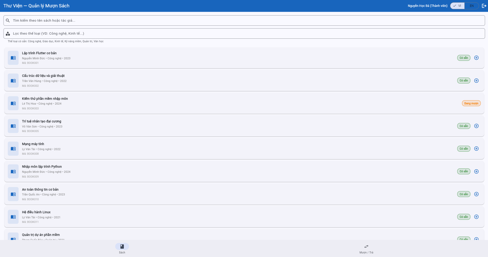

**Proposed Solution:**
- Verify the accuracy of the seed data file for this book record.
- Synchronize the UI status display logic to match the status code returned from the backend/API.

---

## BUG-02: Combining "Flutter" search with "Economics" category still returns books

| Attribute | Details |
| --- | --- |
| **Bug ID** | BUG-02 |
| **Related TC** | TC-16 |
| **Related REQ** | REQ-03 |
| **Severity** | Medium |
| **Date Found** | 27/05/2026 |
| **Status** | Open |

**Steps to Reproduce:**
1. Log in with a member account.
2. Navigate to the "Books" tab.
3. Select the "Economics" (Kinh tế) category.
4. Enter the keyword "Flutter".

**Expected Result:**
No books should be displayed.

**Actual Result:**
The system displays books belonging to the Economics category or containing the name "Flutter".

**Impact:**
Combining the category filter and search keyword does not use the correct intersection logic (AND), resulting in incorrect search results for the user.

**Evidence:**
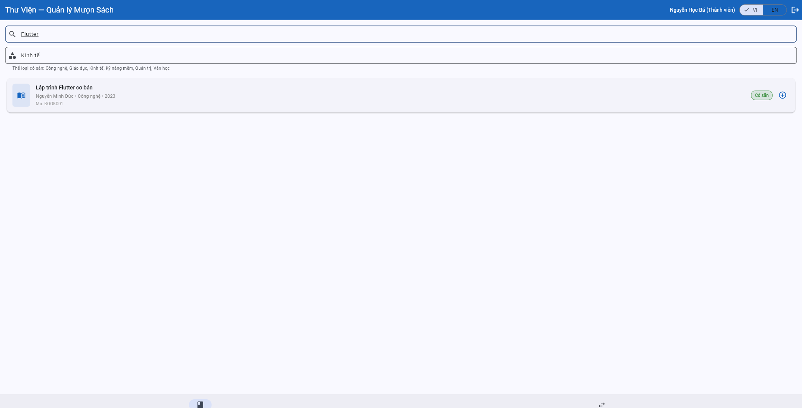

**Proposed Solution:**
Check the logic for combining the category filter and keyword search conditions in the API/UI.

---

## BUG-03: Allows member to borrow a 4th book when the limit of 3 is already reached

| Attribute | Details |
| --- | --- |
| **Bug ID** | BUG-03 |
| **Related TC** | TC-21 |
| **Related REQ** | REQ-04 |
| **Severity** | High — Allows borrowing beyond the limit, violating core business rules |
| **Date Found** | 27/05/2026 |
| **Status** | Open |

**Preconditions:**
Logged in as MEM002, currently has 3 active borrowed books (BOOK001, BOOK006, BOOK007).

**Steps to Reproduce:**
1. Navigate to the "Books" tab.
2. Select BOOK008 (or any "Available" book).
3. Click "Borrow" (Mượn).

**Expected Result:**
The system denies the request and displays a message indicating the limit of 3 books has been reached.

**Actual Result:**
The system allows the borrowing process, and the total number of borrowed books increases to 4.

**Impact:**
Violates the borrowing limit, causing errors in inventory management and borrow/return history.

**Evidence:**
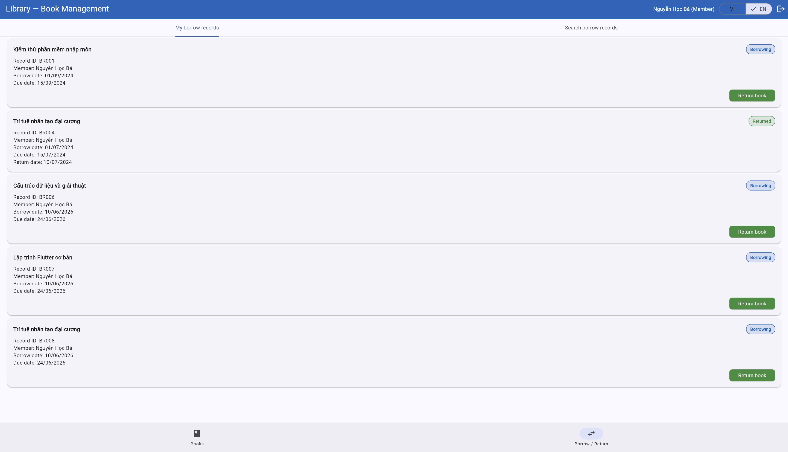

**Proposed Solution:**
Check the borrowing limit condition to ensure the request is blocked when `active_borrows >= 3`.

---

## BUG-04: Suspended account is incorrectly reported as "Expired" when borrowing a book

| Attribute | Details |
| --- | --- |
| **Bug ID** | BUG-04 |
| **Related TC** | TC-19 |
| **Related REQ** | REQ-04 |
| **Severity** | High — Incorrect account status message in the core borrowing flow |
| **Date Found** | 27/05/2026 |
| **Status** | Open |

**Preconditions:**
Logged in as MEM004 (Status: Suspended / Tạm ngưng).

**Steps to Reproduce:**
1. Navigate to the "Books" tab.
2. Select an "Available" book.
3. Click "Borrow".

**Expected Result:**
Displays a message stating the account is suspended.

**Actual Result:**
Displays the message "Member has expired" (Thành viên đã hết hạn).

**Impact:**
Incorrect error message causes users and librarians to misunderstand the account's status.

**Evidence:**
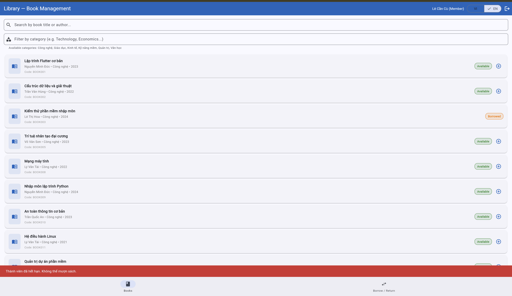

**Proposed Solution:**
Review the mapping between account status and error messages in the book borrowing step.

---

## BUG-05: Librarian has no "Borrow" button on the Books tab — unable to borrow books for members

| Attribute | Details |
| --- | --- |
| **Bug ID** | BUG-05 |
| **Related TC** | No direct TC — Additional discovery |
| **Related REQ** | REQ-04 |
| **Severity** | High — Librarian completely loses the ability to borrow books for members |
| **Date Found** | 06/06/2026 |
| **Status** | Open |

**Preconditions:**
Logged in as Librarian (`librarian@library.com` / `admin123`), data is at seed state.

**Steps to Reproduce:**
1. Log in as Librarian.
2. Navigate to the "Books" tab.
3. Observe the books in the list — check if there is a "Borrow" button for each book.
4. Navigate to the "Borrow / Return" tab.
5. Check if there is a button or form to "Borrow a book" / "Create a borrow record" for members.

**Expected Result:**
The Librarian sees a "Borrow" button on books with an "Available" status in the Books tab, OR there is a form to create borrow records for members in the Borrow / Return tab. (According to SRS Section 1: Librarian has the right to "borrow/return books for members"; Section 4.1: Books tab has a "borrow button" with access for "All").

**Actual Result:**
- Books Tab: No "Borrow" button on any book when logged in as Librarian.
- Borrow / Return Tab: Only a "Return" button exists, no form/functionality to borrow books for members.
- The Librarian is completely unable to borrow books for any member.

**Impact:**
Librarian completely loses the ability to borrow books for members — this is a core business function according to the SRS. Directly violates SRS Section 1 (Librarian privileges) and Section 4.1.

**Evidence:**
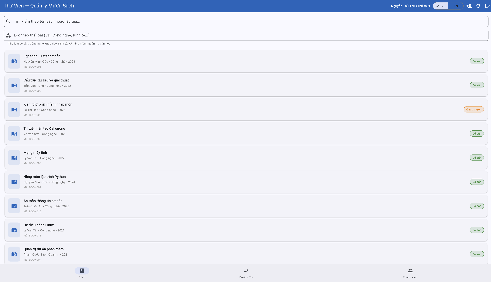
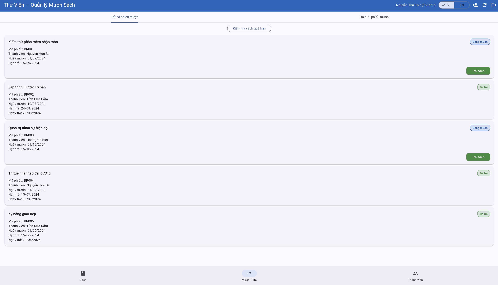

**Proposed Solution:**
Add a "Borrow" button on the Books tab for the Librarian role, with a flow: click Borrow → select member → confirm borrowing the book for that member.

---

## BUG-06: Returning an overdue book displays no warning message

| Attribute | Details |
| --- | --- |
| **Bug ID** | BUG-06 |
| **Related TC** | TC-26 |
| **Related REQ** | REQ-05 |
| **Severity** | High — No warning when returning late, violating business rules |
| **Date Found** | 27/05/2026 |
| **Status** | Open |

**Preconditions:**
BR001 exists: MEM002 borrowed BOOK003, `dueDate` is already overdue.

**Steps to Reproduce:**
1. Log in as MEM002.
2. Navigate to the "Borrow / Return" tab.
3. Return BOOK003.

**Expected Result:**
Displays an overdue return warning when the return is completed.

**Actual Result:**
No warning message is displayed.

**Impact:**
The user is unaware that the book was returned late, missing overdue warning data.

**Evidence:**
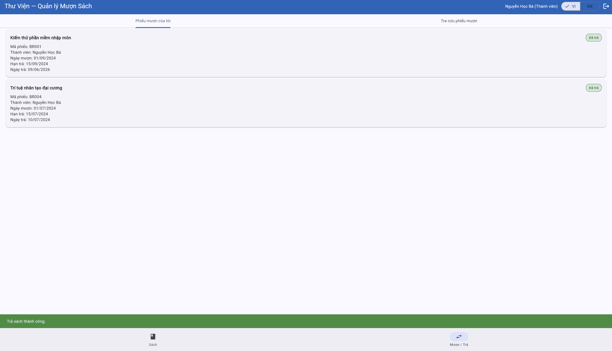

**Proposed Solution:**
Compare `returnDate` and `dueDate` to trigger a warning display when the book is returned late.

---

## BUG-07: Borrow record due exactly today is not marked as Overdue

| Attribute | Details |
| --- | --- |
| **Bug ID** | BUG-07 |
| **Related TC** | TC-27 |
| **Related REQ** | REQ-06 |
| **Severity** | Medium — Incorrect overdue marking at the exact due date boundary |
| **Date Found** | 27/05/2026 |
| **Status** | Open |

**Preconditions:**
A borrow record with a `dueDate` exactly matching the current date is required (e.g., if the test date is 06/06/2026, then `dueDate` = 06/06/2026), status is "Borrowing".
*(Note: This bug is very difficult to reproduce via standard black-box manual testing as the seed data has no records due today. To reproduce manually, borrow a book, then **change the OS system clock** forward exactly 14 days so `dueDate == today`, then log in as Librarian to check).*

**Steps to Reproduce:**
1. Log in as Librarian.
2. Click "Check Overdue" (Kiểm tra quá hạn).

**Expected Result:**
Borrow records where `dueDate == today` are marked as "Overdue" (Because SRS REQ-06 specifies `<=` current date).

**Actual Result:**
The borrow record is not marked as "Overdue".

**Impact:**
Incorrect status at the due date boundary, affecting overdue processing and reminders.

**Evidence:**
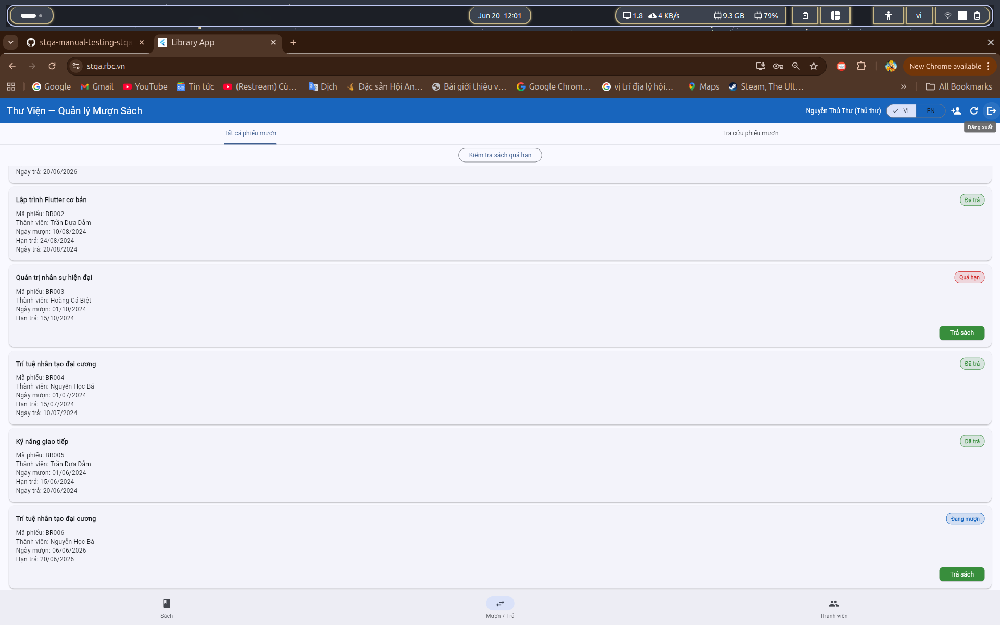

**Proposed Solution:**
Clarify the logic for comparing due dates, correctly handling the `dueDate == today` case (use `<=` instead of `<`).

---

## BUG-08: Clicking "Check Overdue" a second time displays an incorrect number of overdue records

| Attribute | Details |
| --- | --- |
| **Bug ID** | BUG-08 |
| **Related TC** | TC-27 (consistency check extension) |
| **Related REQ** | REQ-06 |
| **Severity** | Medium — Inconsistent results between clicks |
| **Date Found** | 06/06/2026 |
| **Status** | Open |

**Preconditions:**
Logged in as Librarian, data is at seed state, the system has at least 1 overdue record (BR001).

**Steps to Reproduce:**
1. Log in as Librarian (`librarian@library.com` / `admin123`).
2. Navigate to the "Borrow / Return" tab.
3. Click "Check Overdue" once → note the number of marked overdue records.
4. Click "Check Overdue" a second time (with no data changes between the two clicks).
5. Observe the result.

**Expected Result:**
The second result must be identical to the first — same number of overdue records, as data has not changed.

**Actual Result:**
The second click displays a different number of overdue records than the first, despite no data changes.

**Impact:**
Reduces system reliability. The librarian does not know which result is correct for processing overdue records.

**Evidence:**

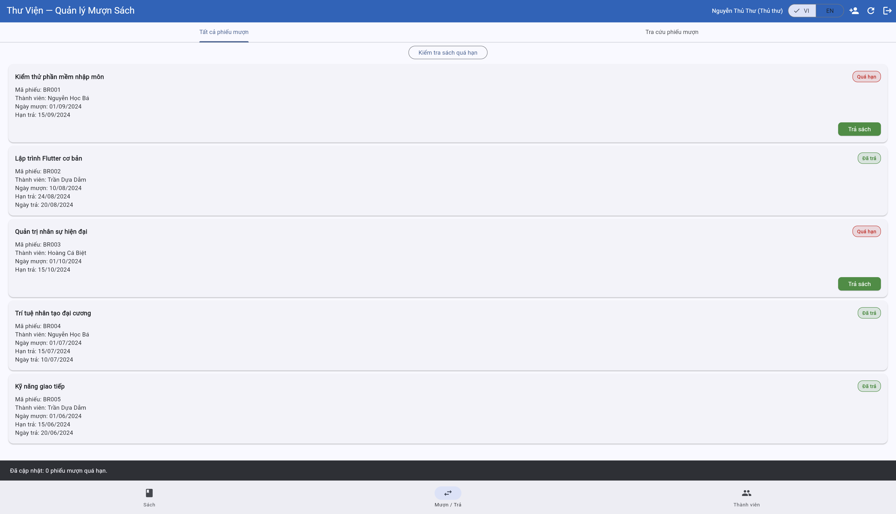

**Proposed Solution:**
Ensure the overdue list is cleared/reset before each scan. The scanning logic must evaluate from scratch.

---

## BUG-09: Email missing a dot in the domain is accepted when adding a new member

| Attribute | Details |
| --- | --- |
| **Bug ID** | BUG-09 |
| **Related TC** | TC-30 |
| **Related REQ** | REQ-07 |
| **Severity** | High — Accepts incorrectly formatted emails, affecting data integrity |
| **Date Found** | 27/05/2026 |
| **Status** | Open |

**Steps to Reproduce:**
1. Log in as Librarian.
2. Navigate to the "Members" (Thành viên) tab and click "Add" (Thêm).
3. Enter the email `user@domain`.
4. Click "Save".

**Expected Result:**
Displays an invalid email error and rejects member creation.

**Actual Result:**
The system successfully creates the member.

**Impact:**
Saves incorrectly formatted emails, causing errors in notifications/reminders and corrupting system data.

**Evidence:**
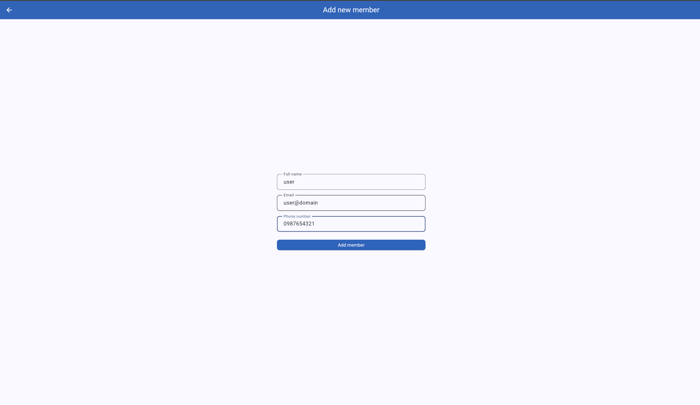
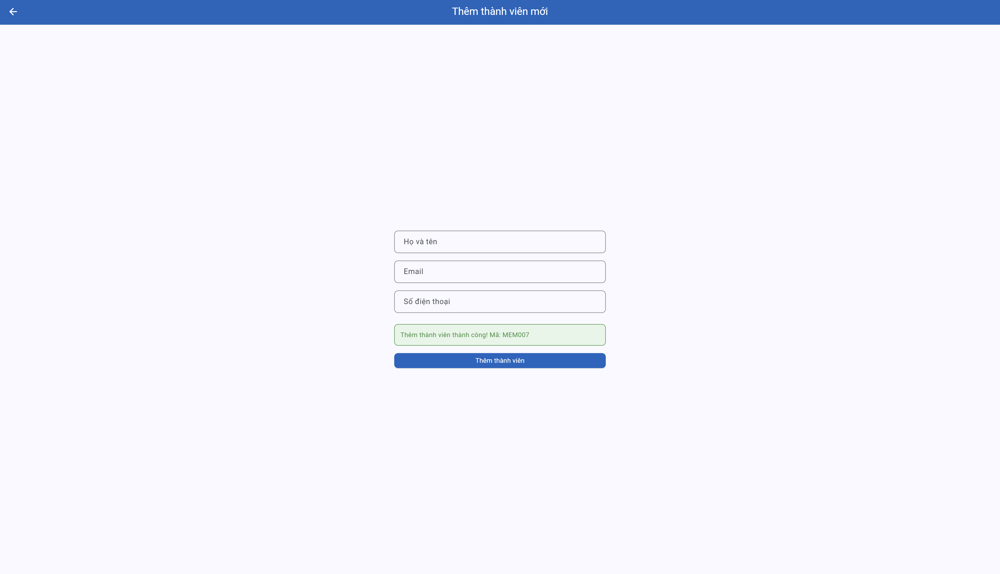

**Proposed Solution:**
Add/tighten the email validation regex, requiring a dot in the domain section.

---

## BUG-10: Valid email is rejected when adding a new member (Regex logic reversed)

| Attribute | Details |
| --- | --- |
| **Bug ID** | BUG-10 |
| **Related TC** | TC-29, **TC-31** |
| **Related REQ** | REQ-07 |
| **Severity** | High — Rejects valid emails, blocking the member creation flow |
| **Date Found** | 27/05/2026 |
| **Status** | Open |

**Steps to Reproduce:**
1. Log in as Librarian.
2. Navigate to the "Members" tab and click "Add".
3. Enter the email `new.member@email.com` (a completely valid email).
4. Click "Save".

**Expected Result:**
Member is successfully added.

**Actual Result:**
Displays an "Invalid email" error.

**Explanation regarding TC-31 (Reject duplicate email):**
TC-31 (Entering `ba.nguyen@email.com`) failing with an "Invalid email" message (instead of "Email already exists") **is a direct consequence of BUG-10**. Because the email format validation logic is reversed (rejecting all correctly formatted emails), the system blocks the action at the Regex format check step before it can even check for duplication. Therefore, the "Invalid email" message for a duplicate email is not an independent bug, but a result of this Regex error.

**Impact:**
Blocks the creation of valid new members, impacting registration workflows. All properly formatted emails are rejected.

**Evidence:**
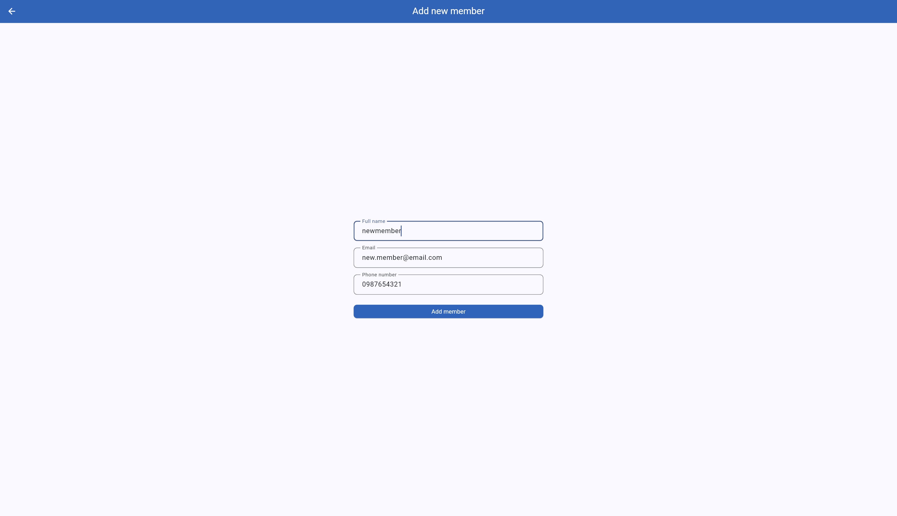
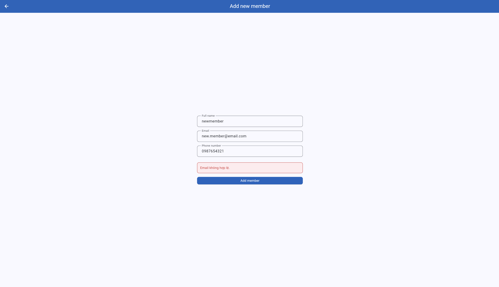

**Proposed Solution:**
Check the email validation logic, fix the reversed regex.

---

## BUG-11: A member can view and return books belonging to another member

| Attribute | Details |
| --- | --- |
| **Bug ID** | BUG-11 |
| **Related TC** | TC-33 |
| **Related REQ** | REQ-08 |
| **Severity** | Critical — Unauthorized data exposure and operation on other members' borrow records |
| **Date Found** | 27/05/2026 |
| **Status** | Open |

**Preconditions:**
Logged in as MEM002, BR003 belonging to MEM006 is in the "Borrowing" status.

**Steps to Reproduce:**
1. Navigate to the "Borrow / Return" tab.
2. Search by member ID `MEM006`.
3. Observe the results and click "Return" on MEM006's borrow record.

**Expected Result:**
Does not display borrow records of other members and denies operation (MEM002 should only see their own records).

**Actual Result:**
The member still sees MEM006's record and can return the book.

**Impact:**
Serious access control violation, data leakage, and unauthorized manipulation.

**Evidence:**
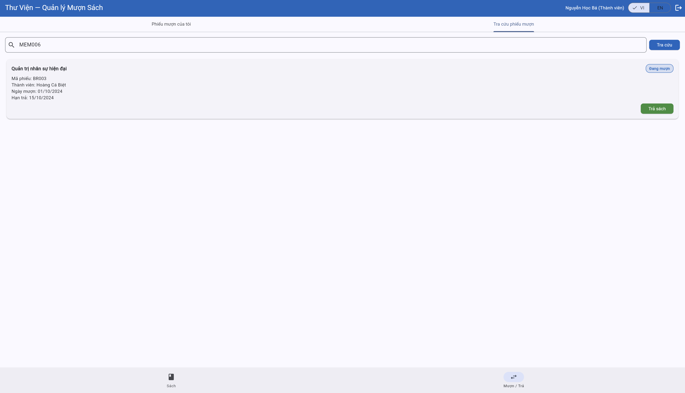

**Proposed Solution:**
Restrict queries by `memberId == currentUserId` for the Member role and check authorization on the backend/controller logic when performing the Return action.
